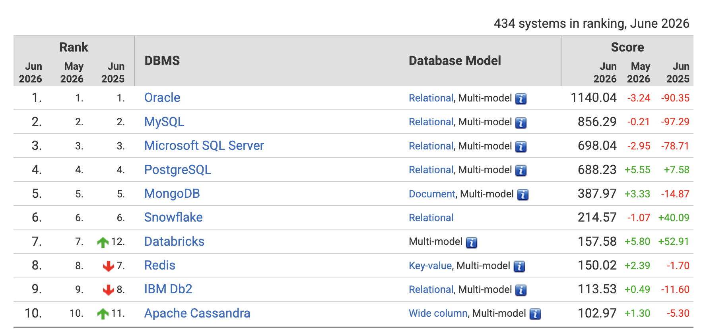
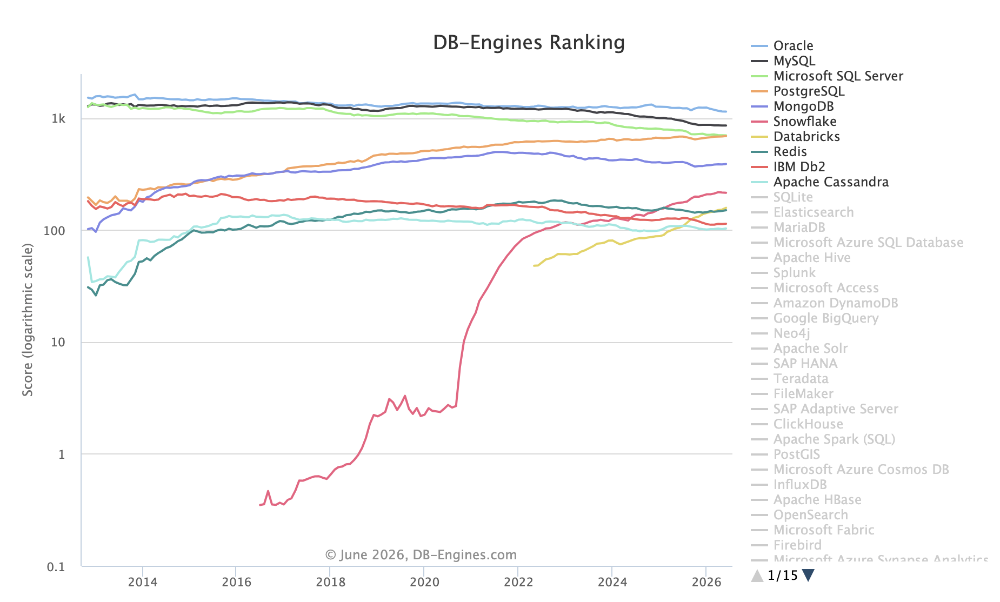

# PostgreSQL 登上 DB-Engines 第三

2026 年 7 月的 [DB-Engines Ranking](https://db-engines.com/en/ranking) 出炉，**PostgreSQL 正式超过 Microsoft SQL Server，登上总榜第三。**

新的前三名变成了：

| 排名 | 数据库 | 2026 年 7 月分数 |
| ---: | --- | ---: |
| 1 | Oracle | <待填 Oracle 7 月分数> |
| 2 | MySQL | <待填 MySQL 7 月分数> |
| 3 | PostgreSQL | <待填 PostgreSQL 7 月分数> |

注：DB-Engines 不是市场份额榜，也不是收入榜，它衡量的是数据库系统在搜索、招聘、技术讨论、社交关注等维度上的综合流行度。但正因为它长期、公开、跨生态，PostgreSQL 站上第三这个节点才有足够强的象征意义：**开发者和企业数据库心智中的 PostgreSQL，已经从“优秀的开源替代品”变成了主流数据库第一梯队成员。**

## 榜单截图

2026 年 6 月的 DB-Engines 排名里，PostgreSQL 还在第四，但已经贴到 SQL Server 身后：

图片来自 [DB-Engines Ranking](https://db-engines.com/en/ranking)。完整趋势仍可在 [DB-Engines Ranking Trend](https://db-engines.com/en/ranking_trend) 查看。

## 反超前夜：6 月只差 9.8 分

这次换位并不突然。2026 年 6 月，SQL Server 仍排第三，PostgreSQL 排第四，但差距已经只剩 **9.80** 分：

| 月份 | SQL Server | PostgreSQL | PostgreSQL 与 SQL Server 差距 |
| --- | ---: | ---: | ---: |
| 2025-06 | 776.75 | 680.65 | -96.10 |
| 2025-09 | 717.32 | 657.17 | -60.15 |
| 2025-12 | 722.52 | 659.42 | -63.09 |
| 2026-03 | 711.47 | 680.08 | -31.39 |
| 2026-04 | 702.08 | 681.35 | -20.73 |
| 2026-05 | 700.99 | 682.68 | -18.31 |
| 2026-06 | 698.04 | 688.24 | -9.80 |
| 2026-07 | <待填> | <待填> | <待填> |

过去一年里，PostgreSQL 的绝对分数只是温和上涨，但 SQL Server 的分数持续下行，两条曲线快速靠近。2025 年 6 月到 2026 年 6 月，PostgreSQL 上涨约 **7.58** 分，SQL Server 下降约 **78.71** 分，两者差距一年缩小约 **86.30** 分。

所以 7 月登上第三，更像是长期趋势终于在榜单上显形，而不是单月噪音制造出的偶然结果。它也让 DB-Engines 前列的结构变得很有意思：Oracle 仍然代表商业数据库时代的高峰，MySQL 仍然是开源数据库普及时代的代表，而 PostgreSQL 已经不再只是“口碑很好的替代选项”，而是进入所有严肃数据库选型都会默认讨论的第一梯队。

## 和 MySQL 正式掰手腕

PostgreSQL 登上第三之后，接下来的参照物自然变成 MySQL。

这并不是说 SQL Server 不重要了。它仍然是大量企业系统、Microsoft 技术栈、传统 BI 和存量应用里的关键数据库。但 DB-Engines 反映的是更宽的流行度信号：搜索、招聘、技术讨论、社区关注。PostgreSQL 在这里超过 SQL Server，说明新增项目、开发者偏好、云原生应用、数据工程和 AI 应用栈里的注意力，已经明显向 PostgreSQL 倾斜。

截至 2026 年 6 月，MySQL 是 **856.29**，PostgreSQL 是 **688.24**，两者差距仍有 **168.05** 分。这个差距不小，PostgreSQL 并不是马上就要超过 MySQL。

但趋势已经值得 MySQL 认真对待：

- MySQL 过去一年下降约 **97.29** 分。
- PostgreSQL 过去一年上涨约 **7.58** 分。
- 两者相对差距一年缩小约 **104.87** 分。

换句话说，PostgreSQL 登上第三不是终点，而是下一场竞争的起点。SQL Server 这一关过了之后，PostgreSQL 真正要掰手腕的对象，是 MySQL 的开源数据库第一心智。

## Stack Overflow most popular database

DB-Engines 是综合流行度指标，Stack Overflow Developer Survey 则更偏开发者使用与偏好。两者口径不同，但方向高度一致。

这个转折其实在 2023 年就已经发生。[Stack Overflow Developer Survey 2023 的数据库分类](https://survey.stackoverflow.co/2023#databases)明确写道：PostgreSQL 当年从 MySQL 手里接过第一名。在 All Respondents 口径下，PostgreSQL 使用率为 **45.55%**，MySQL 为 **41.09%**；Professional Developers 更偏 PostgreSQL（约 **50%**），而 learning to code 群体则更偏 MySQL（约 **54%**）。

一年后的 [Stack Overflow Developer Survey 2024 的数据库分类](https://survey.stackoverflow.co/2024/technology#1-databases)进一步回顾了 PostgreSQL 的变化：PostgreSQL 在 2018 年首次进入开发者调查时，使用率是 **33%**；当年最受欢迎的是 MySQL，使用率 **59%**。六年之后，PostgreSQL 使用率升至 **48.7%**，并且已经是**连续第二年**最受欢迎的数据库。

到 [Stack Overflow Developer Survey 2025 的数据库分类](https://survey.stackoverflow.co/2025/technology#1-databases)，这个领先地位继续扩大：

- All Respondents 中，PostgreSQL 为 **55.6%**，MySQL 为 **40.5%**，SQLite 为 **37.5%**。
- Professional Developers 中，PostgreSQL 为 **58.2%**，MySQL 为 **39.6%**。
- 在 Desired / Admired 维度，页面说明 PostgreSQL 自 2023 年以来一直是数据库类别中最 desired、最 admired 的技术；2025 年 PostgreSQL 的 Desired 为 **46.5%**，Admired 为 **65.5%**。

这组数据说明，PostgreSQL 的上升不是只发生在榜单算法里。它已经体现在开发者过去一年实际使用了什么、未来还想继续使用什么，以及愿意向别人推荐什么。

## 为什么是 PostgreSQL

PostgreSQL 的势能不是靠单点功能堆出来的，而是几个长期方向叠加后的结果。

**默认选择地位增强。** 新项目在需要关系数据库时，PostgreSQL 越来越多地成为默认答案，而不是“高级替代品”。它既能服务传统 OLTP，也能承接 JSON、全文检索、分析扩展、向量检索等更宽的应用需求。

**扩展生态成熟。** PostGIS、Timescale、Citus、pgvector、FDW、逻辑复制等生态，让 PostgreSQL 从单纯关系数据库扩展到地理、时序、分布式、向量和数据集成场景。很多新需求不再需要先换数据库，而是先看 PostgreSQL 生态里有没有合适扩展。

**云托管降低运维门槛。** RDS、Aurora、Cloud SQL、AlloyDB、Azure Database for PostgreSQL、Neon、Supabase 等服务，让 PostgreSQL 的采用门槛显著下降。过去需要 DBA 团队承担的很多工作，现在可以由托管服务消化。

**开源与商业路径并存。** 企业可以从社区版起步，也可以在云厂商、发行版厂商和服务商之间选择支持路径。这种结构避免了被单一商业授权模式锁住，也让 PostgreSQL 在创业公司、传统企业和云平台之间都能找到落点。

**AI 应用带来的新入口。** pgvector 不是 PostgreSQL 成功的全部原因，但它确实让 PostgreSQL 在 AI 应用浪潮中重新进入大量开发者视野。许多团队并不想为了向量检索立即引入一套新的专用数据库；在已有 PostgreSQL 里扩展能力，是更自然的工程选择。

## 不要误读这个排名

PostgreSQL 登上第三很重要，但也需要避免几个误读。

首先，DB-Engines 分数不是市场份额。它不能直接换算成生产实例数量、企业收入、云账单或数据库负载。

SQL Server 也并没有“失败”。它仍然是大量企业系统、Windows/.NET 技术栈、传统 BI 和 Microsoft 生态里的关键数据库。PostgreSQL 的反超更多说明新增选择和开发者心智已经转向，而不是存量世界一夜之间重写。

MySQL 同样仍然很强。MySQL 的历史安装基数、Web 生态惯性、兼容产品分叉和托管服务入口都非常深。PostgreSQL 现在有资格和 MySQL 正面对话，但这场竞争不会在一个月内结束。

## 结语

PostgreSQL 登上 DB-Engines 第三，是一个迟早会发生、但真正发生时仍然值得记录的节点。

它标志着 PostgreSQL 已经完成一次身份转换：从“开源数据库里的强者”，变成“整个数据库行业第一梯队的成员”。接下来，PostgreSQL 的参照物不再只是 SQL Server，而是 MySQL、Oracle，以及所有正在被云原生、AI 应用和开发者偏好重新塑造的数据库使用场景。

如果说 Stack Overflow 2025 调查已经提前说明 PostgreSQL 是开发者最常使用、最想继续使用的数据库，那么 DB-Engines 第三名就是公开榜单对这个趋势的一次正式确认。

## 发布前需要替换的数据

- `<待填 Oracle 7 月分数>`
- `<待填 MySQL 7 月分数>`
- `<待填 PostgreSQL 7 月分数>`
- `<待填 SQL Server 7 月分数>`
- 表格中的 2026-07 行
